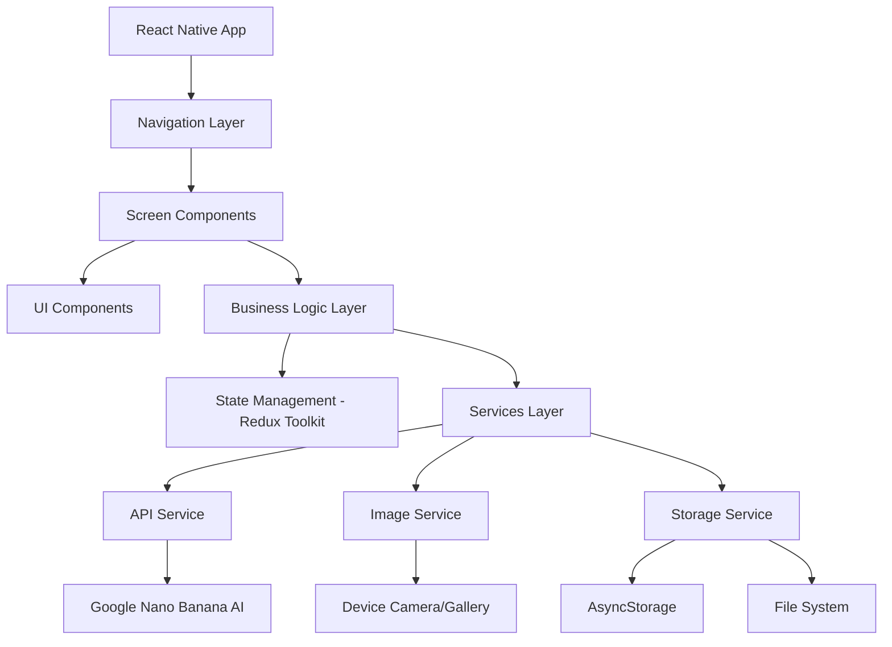

# Design Document

## Overview

The AI Interior Design App is a React Native mobile application that leverages artificial intelligence to transform interior spaces through photo-based design generation. The app follows a multi-step workflow where users upload photos of their spaces, select room types and design preferences, and receive AI-generated redesigns using Google Nano Banana AI service.

The application architecture emphasizes modularity, performance, and user experience with a clean separation between UI components, business logic, and external service integrations. The design supports both iOS and Android platforms through React Native's cross-platform capabilities.

## Architecture

### High-Level Architecture



### Technology Stack

- **Framework**: React Native 0.72+
- **Navigation**: React Navigation 6
- **State Management**: Redux Toolkit with RTK Query
- **UI Components**: React Native Elements + Custom Components
- **Image Handling**: React Native Image Picker + React Native Fast Image
- **Storage**: AsyncStorage + React Native File System
- **AI Integration**: Google Nano Banana API
- **Styling**: StyleSheet with theme system
- **Testing**: Jest + React Native Testing Library

### Project Structure

```
src/
├── components/           # Reusable UI components
│   ├── common/          # Generic components (Button, Card, etc.)
│   ├── forms/           # Form-specific components
│   └── media/           # Image/media components
├── screens/             # Screen components
│   ├── Dashboard/       # Main dashboard screen
│   ├── Workflow/        # 4-step design workflow screens
│   ├── Results/         # Results and preview screens
│   └── Profile/         # User profile screens
├── navigation/          # Navigation configuration
├── services/            # External service integrations
├── store/              # Redux store and slices
├── utils/              # Utility functions
├── constants/          # App constants and themes
└── types/              # TypeScript type definitions
```

## Components and Interfaces

### Core Components

#### 1. Navigation System

**BottomTabNavigator**
- Manages three main tabs: Tools, Create, My Profile
- Integrates with React Navigation bottom tabs
- Handles tab state and navigation flow

**WorkflowStackNavigator**
- Manages the 4-step design workflow
- Implements stack navigation with progress tracking
- Handles back navigation and state preservation

#### 2. Screen Components

**DashboardScreen**
- Displays six design category cards with preview images
- Implements grid layout with responsive design
- Handles category selection and navigation to workflow

**WorkflowScreens**
- PhotoUploadScreen: Image selection and upload interface
- RoomTypeScreen: Grid selection for room types
- StyleSelectionScreen: Design style picker
- ColorPaletteScreen: Color palette selection

**ResultsScreen**
- Full-screen image display with action buttons
- Implements regenerate, share, and save functionality
- Handles loading states during AI processing

#### 3. UI Components

**CategoryCard**
```typescript
interface CategoryCardProps {
  title: string;
  tagline: string;
  beforeImage: string;
  afterImage: string;
  onPress: () => void;
}
```

**ProgressIndicator**
```typescript
interface ProgressIndicatorProps {
  currentStep: number;
  totalSteps: number;
}
```

**SelectionGrid**
```typescript
interface SelectionGridProps<T> {
  items: T[];
  selectedItem?: T;
  onSelect: (item: T) => void;
  renderItem: (item: T) => React.ReactNode;
}
```

**ImageUploader**
```typescript
interface ImageUploaderProps {
  onImageSelected: (imageUri: string) => void;
  placeholder?: React.ReactNode;
}
```

### Service Interfaces

#### AI Service Interface
```typescript
interface AIService {
  generateDesign(params: DesignGenerationParams): Promise<DesignResult>;
  regenerateDesign(designId: string): Promise<DesignResult>;
}

interface DesignGenerationParams {
  imageUri: string;
  roomType: RoomType;
  style: DesignStyle;
  colorPalette: ColorPalette;
}

interface DesignResult {
  id: string;
  originalImage: string;
  transformedImage: string;
  metadata: DesignMetadata;
}
```

#### Image Service Interface
```typescript
interface ImageService {
  pickFromGallery(): Promise<string>;
  takePhoto(): Promise<string>;
  saveToDevice(imageUri: string): Promise<boolean>;
  shareImage(imageUri: string): Promise<void>;
}
```

#### Storage Service Interface
```typescript
interface StorageService {
  saveDesign(design: DesignResult): Promise<void>;
  getDesigns(): Promise<DesignResult[]>;
  deleteDesign(designId: string): Promise<void>;
  saveUserPreferences(preferences: UserPreferences): Promise<void>;
}
```

## Data Models

### Core Data Types

```typescript
enum RoomType {
  KITCHEN = 'kitchen',
  LIVING_ROOM = 'living_room',
  HOME_OFFICE = 'home_office',
  BEDROOM = 'bedroom',
  BATHROOM = 'bathroom',
  DINING_ROOM = 'dining_room',
  COFFEE_SHOP = 'coffee_shop',
  STUDY_ROOM = 'study_room',
  RESTAURANT = 'restaurant',
  GAMING_ROOM = 'gaming_room',
  OFFICE = 'office',
  ATTIC = 'attic'
}

enum DesignStyle {
  MODERN = 'modern',
  SCANDINAVIAN = 'scandinavian',
  INDUSTRIAL = 'industrial',
  MINIMALIST = 'minimalist',
  BOHEMIAN = 'bohemian',
  TRADITIONAL = 'traditional'
}

enum ColorPalette {
  SURPRISE_ME = 'surprise_me',
  MILLENNIAL_GRAY = 'millennial_gray',
  TERRACOTTA_MIRAGE = 'terracotta_mirage',
  NEON_SUNSET = 'neon_sunset',
  FOREST_HUES = 'forest_hues',
  PEACH_ORCHARD = 'peach_orchard',
  FUSCHIA_BLOSSOM = 'fuschia_blossom',
  EMERALD_GEM = 'emerald_gem',
  PASTEL_BREEZE = 'pastel_breeze'
}

interface WorkflowState {
  currentStep: number;
  selectedImage?: string;
  roomType?: RoomType;
  designStyle?: DesignStyle;
  colorPalette?: ColorPalette;
  isProcessing: boolean;
  result?: DesignResult;
}

interface UserProfile {
  id: string;
  savedDesigns: DesignResult[];
  preferences: UserPreferences;
}

interface UserPreferences {
  favoriteStyles: DesignStyle[];
  defaultColorPalettes: ColorPalette[];
  notificationsEnabled: boolean;
}
```

### State Management Schema

```typescript
interface RootState {
  workflow: WorkflowState;
  user: UserProfile;
  designs: {
    saved: DesignResult[];
    recent: DesignResult[];
    loading: boolean;
    error?: string;
  };
  app: {
    theme: 'light' | 'dark';
    isOnline: boolean;
    lastSync: string;
  };
}
```

## Error Handling

### Error Categories

1. **Network Errors**
   - AI service unavailable
   - Poor internet connection
   - API rate limiting

2. **Image Processing Errors**
   - Invalid image format
   - Image too large
   - Camera/gallery access denied

3. **Storage Errors**
   - Insufficient device storage
   - File system access issues
   - Data corruption

### Error Handling Strategy

```typescript
interface AppError {
  code: string;
  message: string;
  category: 'network' | 'image' | 'storage' | 'ai' | 'unknown';
  recoverable: boolean;
  retryAction?: () => void;
}

class ErrorHandler {
  static handle(error: AppError): void {
    // Log error for analytics
    // Show user-friendly message
    // Provide recovery options if available
  }
}
```

### Retry Mechanisms

- **AI Processing**: Automatic retry with exponential backoff (max 3 attempts)
- **Image Upload**: Manual retry with progress indication
- **Network Requests**: Automatic retry for transient failures
- **Storage Operations**: Immediate retry with fallback to cache

## Testing Strategy

### Unit Testing

**Components Testing**
- Test component rendering with different props
- Test user interactions and event handlers
- Test conditional rendering logic
- Mock external dependencies

**Services Testing**
- Test API integration with mocked responses
- Test error handling scenarios
- Test data transformation logic
- Test storage operations

**State Management Testing**
- Test Redux reducers and actions
- Test async thunks and side effects
- Test state selectors
- Test middleware functionality

### Integration Testing

**Workflow Testing**
- Test complete user journey from upload to results
- Test navigation between screens
- Test state persistence across app lifecycle
- Test offline/online behavior

**AI Integration Testing**
- Test Google Nano Banana API integration
- Test image processing pipeline
- Test error scenarios and fallbacks
- Test performance with large images

### Performance Testing

**Image Handling**
- Test memory usage with large images
- Test loading times for image operations
- Test concurrent image processing
- Test cache effectiveness

**AI Processing**
- Test response times for different image sizes
- Test concurrent request handling
- Test timeout scenarios
- Test bandwidth usage optimization

### Device Testing

**Cross-Platform Testing**
- Test on iOS and Android devices
- Test different screen sizes and orientations
- Test device-specific features (camera, storage)
- Test performance on older devices

**Accessibility Testing**
- Test screen reader compatibility
- Test keyboard navigation
- Test color contrast and visual accessibility
- Test touch target sizes

### Testing Tools and Setup

```typescript
// Jest configuration for React Native
module.exports = {
  preset: 'react-native',
  setupFilesAfterEnv: ['<rootDir>/src/test/setup.ts'],
  transformIgnorePatterns: [
    'node_modules/(?!(react-native|@react-native|react-navigation)/)'
  ],
  collectCoverageFrom: [
    'src/**/*.{ts,tsx}',
    '!src/**/*.d.ts',
    '!src/test/**/*'
  ]
};

// Testing utilities
export const renderWithProviders = (
  ui: React.ReactElement,
  options?: RenderOptions
) => {
  const store = setupStore();
  const Wrapper = ({ children }: { children: React.ReactNode }) => (
    <Provider store={store}>
      <NavigationContainer>
        {children}
      </NavigationContainer>
    </Provider>
  );
  return render(ui, { wrapper: Wrapper, ...options });
};
```

This design provides a robust foundation for building the AI Interior Design app with proper separation of concerns, scalable architecture, and comprehensive testing coverage.